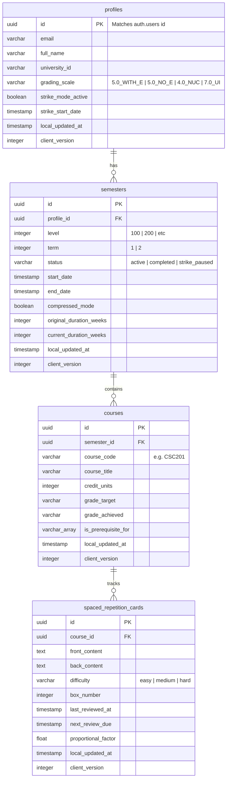

# Smart Student Hub v4 — Comprehensive System Architecture

This master system architecture document outlines the complete technical blueprint for **Smart Student Hub v4**, an offline-first academic operating system built exclusively for Nigerian university students.

---

## 🗺️ 1. Global Architectural Topography

The system utilizes the **A.N.T Architecture Pattern** to decouple presentation, routing, and calculations, ensuring total operability during cellular outages and extreme resource constraints.

```mermaid
graph TB
    subgraph Client Device (Browser Sandbox)
        UI[Next.js PWA UI - Layer 2 Navigation]
        ZStore[Zustand Memory Store]
        DexieDB[(Local IndexedDB - Dexie)]
        WALOutbox[(Reconciliation WAL Outbox)]
        SyncWorker[Service / Web Worker Sync Engine]
    end

    subgraph Edge Layer (Cloudflare CDN)
        WAF{Cloudflare WAF / Lagos Edge}
    end

    subgraph Cloud Infrastructure (Supabase Platform)
        Auth[Supabase Auth Engine]
        Postgres[(Supabase PostgreSQL - Cloud Authority)]
        Realtime[Supabase Realtime Pub-Sub]
    end

    UI <--> ZStore
    ZStore <--> DexieDB
    ZStore --> WALOutbox
    WALOutbox --> SyncWorker
    SyncWorker --> WAF
    WAF --> Postgres
    WAF --> Auth
    Postgres -.-> Realtime
    Realtime -.-> SyncWorker
```

---

## 📱 2. Frontend Architecture (Layer 2 Navigation)

### A. Directory Design (Next.js App Router)
The frontend is constructed using a modern React layout structured to run cleanly on low-power viewports:

```text
frontend/
├── app/
│   ├── layout.tsx             # Root layout (Theme provider, Zustand provider)
│   ├── page.tsx               # App entry-point (Landing / Dashboard redirector)
│   ├── onboarding/
│   │   └── page.tsx           # Multi-step university setup sequence
│   ├── dashboard/
│   │   ├── page.tsx           # Main workspace (Academic elastic calendar, CGPA display)
│   │   └── courses/
│   │       └── page.tsx       # Course manager (Target grades vs achieved grades)
│   ├── spaced-repetition/
│   │   └── page.tsx           # Flashcard study decks (Leitner scheduler)
│   └── settings/
│       └── page.tsx           # Synced device management & manual DB tools
├── components/
│   ├── ui/                    # Premium Tailwind & Framer Motion base components
│   └── academic/              # Course cards, GPA calculators, and countdown widgets
├── hooks/
│   └── useDexieDB.ts          # React bindings to local IndexedDB
└── store/
    └── useAcademicStore.ts    # Zustand main state machine
```

### B. Decoupling Rules (A.N.T Layering Compliance)
*   **Layer 2 (Navigation):** React files under `/frontend/app` orchestrate user interaction. They are **read-only** with respect to calculation logic. They never perform GP, CGPA, Spaced Repetition interval shifts, or calendar compression formulas directly.
*   **Layer 3 (Tools):** When a calculation is needed, Layer 2 components dispatch inputs to deterministic modules under `/tools` and bind the output to Zustand memory states.

---

## ☁️ 3. Backend Architecture (Cloud Authority)

Supabase serves as the eventual cloud database and authentication provider.

### A. Relational Database Schema (PostgreSQL)



### B. Row Level Security (RLS) & Isolation Policies
RLS is configured globally on all tables. Students can access only their own data. Sub-queries resolve semester and course ownership chains dynamically:
```sql
CREATE POLICY "Strict Course User Access" ON courses
FOR ALL TO authenticated
USING (
  semester_id IN (
    SELECT id FROM semesters WHERE profile_id = auth.uid()
  )
);
```

---

## 🔄 4. Synchronization Engine Design (Eventual Consistency)

Offline actions must write instantly to local storage while background tasks synchronize with the cloud backend during network availability.

```
[Write Action: Edit Course Grade]
               │
               ▼
   [Dexie Course Table Update] ───────(Atomic Transaction)───────► [Write Event to WAL Outbox]
  (Set sync_status = 'pending_update')                               (reconciliation_queue)
               │
               ▼
  [Zustand Local Render (<10ms)]
               │
               ├─────────────────── [NETWORK OFFLINE] ───────────────────┐
               │                                                          │
               ▼ [NETWORK ONLINE]                                         ▼
   [Sync Worker Triggers Loop]                                   [Mutation Preserved Locally]
               │                                                          │
               ▼                                                          ▼
  [Batch JSON Push to Supabase]                                   [Re-evaluate on Connection]
               │
               ├───► [Sync Success]: Clean Outbox, set status = 'synced'
               │
               └───► [Sync Conflict]: Run Client-Version Resolution Rules
```

### Conflict Resolution Matrix:
*   Every table maintains `client_version: INTEGER` and `local_updated_at: TIMESTAMP`.
*   **The Conflict Algorithm:**
    1.  If `Payload.client_version > DB.client_version`: **Client wins**. Update DB, increment `client_version`.
    2.  If `Payload.client_version <= DB.client_version` (Concurrency clash):
        *   If `Payload.local_updated_at > DB.local_updated_at`: **Client wins**. Apply updates.
        *   If `Payload.local_updated_at <= DB.local_updated_at`: **Server wins**. Update local Dexie DB with server data, set status to `'synced'`, and delete outbox event.
    3.  **Grade Lock rule:** The server rejects client writes targeting finalized grades if `courses.grade_achieved` holds verified university marks.

---

## 💾 5. Multi-Tier Caching Strategy

To survive electrical grids collapses and data expense limits, caching is applied at four specific levels:

```
[ Client View Request ]
         │
         ├───► Level 1: Zustand Store (In-Memory React Reactive State) ── [Hits: <1ms]
         │
         ├───► Level 2: Dexie / IndexedDB (Persistent Sandbox Storage) ─ [Hits: <5ms]
         │
         ├───► Level 3: Service Worker Cache (Pre-compiled Static Files) ── [Hits: <50ms]
         │
         └───► Level 4: Cloudflare CDN Edge (Lagos API Route Cache) ───── [Hits: <120ms]
```

1.  **Zustand Store (Level 1):** In-memory JavaScript objects providing instant reads for active React pages.
2.  **Dexie IndexedDB (Level 2):** Persistent local database storage. Hydrates Zustand on page reloads.
3.  **Service Worker Cache (Level 3):** Fully intercepts static routing to cache assets, images, and HTML wrappers.
4.  **Cloudflare Edge (Level 4):** Standardized static university directories and departmental code templates are cached at Cloudflare African routing nodes.

---

## ⚙️ 6. Service Worker Strategy

The service worker is configured to prioritize **Cache-First** delivery for static assets and **Network-First** delivery for API routes, ensuring offline operability:

```javascript
// service-worker.js

const STATIC_CACHE = 'smarthub-static-v4';
const API_CACHE = 'smarthub-api-v4';

const OFFLINE_ASSETS = [
  '/',
  '/index.html',
  '/manifest.json',
  '/styles/globals.css',
  '/js/app.js',
  '/fonts/inter.woff2',
  '/offline.html' // Fallback layout when index is inaccessible
];

// 1. Installation: Pre-cache static UI wrappers
self.addEventListener('install', event => {
  event.waitUntil(
    caches.open(STATIC_CACHE).then(cache => cache.addAll(OFFLINE_ASSETS))
  );
  self.skipWaiting();
});

// 2. Activation: Clean legacy structures
self.addEventListener('activate', event => {
  event.waitUntil(
    caches.keys().then(keys => Promise.all(
      keys.filter(key => key !== STATIC_CACHE).map(key => caches.delete(key))
    ))
  );
  self.clients.claim();
});

// 3. Routing: Cache-First for assets, Network-First for API data
self.addEventListener('fetch', event => {
  const requestUrl = new URL(event.request.url);

  // Skip remote sync payloads and Supabase connection routes
  if (requestUrl.pathname.startsWith('/rest/v1')) {
    event.respondWith(
      fetch(event.request)
        .catch(() => caches.match('/offline.html'))
    );
    return;
  }

  // Assets load directly from cache
  event.respondWith(
    caches.match(event.request).then(cachedResponse => {
      return cachedResponse || fetch(event.request).then(networkResponse => {
        if (networkResponse.status === 200) {
          const cacheCopy = networkResponse.clone();
          caches.open(STATIC_CACHE).then(cache => cache.put(event.request, cacheCopy));
        }
        return networkResponse;
      });
    }).catch(() => caches.match('/offline.html'))
  );
});
```

---

## 🔑 7. Authentication Architecture

Smart Student Hub utilizes **Supabase Auth** paired with a secure local fallback mechanism to protect user access.

```
                  [ Student Accesses App ]
                             │
                             ▼
                 [ Checks Local Auth Session ]
                             │
                 ┌───────────┴───────────┐
                 ▼                       ▼
           [ Session Found ]       [ No Session ]
                 │                       │
      [ Decrypts local Token ]   [ Creates Guest Account ]
                 │                - Generates local UUID
                 ▼                - Writes to local IndexedDB
         [ Validates JWT ]        - Full Offline Use Enabled
                 │
         ┌───────┴───────┐
         ▼               ▼
     [ Valid ]      [ Expired ]
         │               │
     [ Access ]   [ Attempts Sync ]
                         │
                 ┌───────┴───────┐
                 ▼               ▼
             [ Online ]      [ Offline ]
                 │               │
         [ Refreshes JWT ]   [ Decrypts cache ]
```

### Guest to Synced User Transition:
1.  A student can onboarding as an **Offline Guest**. The system generates a local UUID and stores all course inputs inside Dexie.
2.  When the student signs up (creates a cloud account):
    *   The system initializes a remote profile in Supabase Auth.
    *   The outbox sync worker updates all local IndexedDB course and card records by replacing the mock guest key with the verified `user_id`.
    *   The worker bulk-upserts the complete local IndexedDB database into Supabase in a single sync transaction.

---

## 🧠 8. State Management Architecture (Zustand)

Global memory management runs in a single Zustand state store, functioning as an reactive in-memory layer above IndexedDB.

### A. Store Topology:
```typescript
interface AcademicState {
  profile: Profile | null;
  semesters: Semester[];
  courses: Course[];
  cards: SpacedRepCard[];
  syncPending: boolean;
  
  // Actions
  initializeStore: () => Promise<void>; // Hydrates memory from Dexie IndexedDB
  addCourse: (course: NewCourse) => Promise<void>;
  updateGrade: (courseId: string, grade: string) => Promise<void>;
  toggleStrikeMode: () => Promise<void>;
  triggerSyncFlush: () => Promise<void>;
}
```

### B. Reactive Write Flow:
1.  React UI triggers an action (e.g. `updateGrade("PHY111", "A")`).
2.  Zustand mutates its in-memory arrays and triggers a React render cycle instantly (<10ms).
3.  Zustand initiates a non-blocking asynchronous call to write to Dexie and push a log to the outbox queue.
4.  Zustand checks connection status and invokes the background replication loop.

---

## 📢 9. Notification Architecture

Reminders and notifications use a multi-channel approach optimized for bandwidth constraints:

```
                            [ Notification Event ]
                                      │
                         ┌────────────┴────────────┐
                         ▼                         ▼
            [ Remote Server Push ]       [ Native Local Copier ]
              - Firebase Web Push          - WhatsApp deep link
              - Text-only reminder         - Clipboard formatters
              - Strike news updates        - Encoded deck links
```

### A. WhatsApp Integration Deep-Link Generation:
To share resources without server overhead, flashcard decks are compressed into short JSON strings and encoded into native WhatsApp sharing URLs:
```typescript
export function generateWhatsAppLink(deckTitle: string, cardsCount: number, deckId: string): string {
  const message = `📚 *SmartHub Card Deck*\n` +
                  `──────────────────────────\n` +
                  `🎓 Title: ${deckTitle}\n` +
                  `🔥 Items: ${cardsCount} Cards\n\n` +
                  `Import this deck directly into your PWA Workspace:\n` +
                  `👉 https://smarthub.student/deck/${deckId}\n` +
                  `──────────────────────────`;
  return `https://wa.me/?text=${encodeURIComponent(message)}`;
}
```

### B. Web Push Reminders Rules:
*   Reminders must use plain text payloads (<2KB) to conserve data budgets.
*   **Low-Battery Rule:** If `navigator.getBattery()` indicates battery level $< 15\%$, background synchronization is suspended to preserve device longevity.

---

## 📊 10. Analytics Architecture (Privacy-First & Low Data)

To support performance on low-end hardware and conserve students' internet data, we utilize **PostHog** under a strict buffering envelope:

```
[ UI User Interaction Event ]
             │
             ▼
  [ Buffered in local Dexie ] (PostHog offline buffer table)
             │
    * * * ENGINE MONITORS BATTERY & CHARGING STATUS * * *
             │
             ▼
[ Upload events ONLY when Online, Charging, and Battery > 30% ]
```

*   **Buffering System:** Analytics events are captured locally in `IndexedDB`. No network calls are executed dynamically.
*   **Flush Conditions:** Events are serialized and uploaded in batches only when:
    1.  `navigator.onLine` is true.
    2.  `battery.charging` is true OR `battery.level > 0.30` (consering battery life).
*   **Opt-out Support:** Students can toggle telemetry off inside Settings, immediately purging local buffers and stopping collection.

---

## 🏗️ 11. Production Deployment Architecture

Deployments are automated through Vercel and secured at the edge by Cloudflare:

```
[ Student Device ]
       │
       ▼ (MTN / Airtel / Glo Cellular Networks)
[ Cloudflare CDN African Edge Nodes ]
       │
       ├───► Cached Static Assets (PWA wrappers, manifest) -> Returned in <50ms
       │
       └───► Dynamic REST / RPC API routes
                 │
                 ├───► [ Supabase Edge Gateway ]
                 │          - Auth verify validation
                 │          - Database updates
                 │
                 └───► [ Vercel Serverless Functions ]
                            - Paystack verification calls
                            - Dynamic metadata rendering
```

### Edge Caching and Headers (Cloudflare Configuration):
*   **Brotli Compression (Level 4):** Activated globally to reduce PWA package weight.
*   **African Routing Optimizations:** Traffic is routed through regional CDN edge nodes (Lagos, Nigeria) to ensure low ping times for local students.
*   **Rocket Loader:** Deactivated to prevent conflicts with the Service Worker routing lifecycle.
*   **Cache Control Headers:** All static files served from Vercel use strict immutable headers to prevent redundant download overhead:
    `Cache-Control: public, max-age=31536000, immutable`
