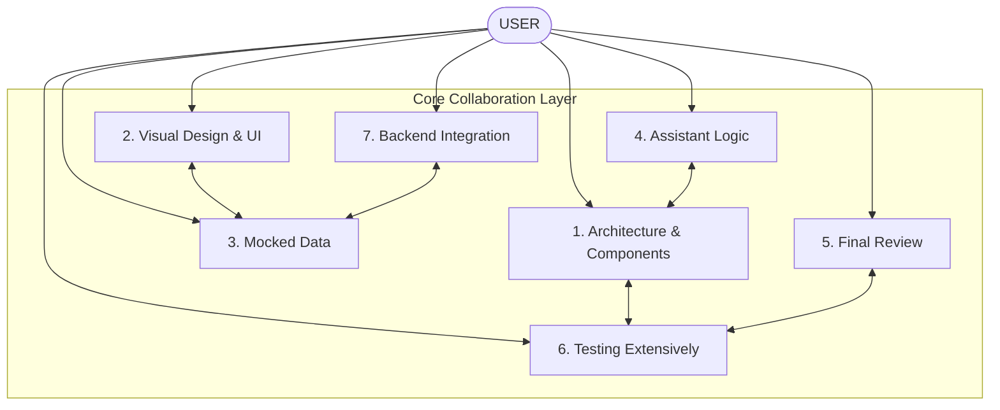

# Smart Student Hub v4 — Project Sub-Agent Division

This document outlines the collaborative, multi-agent workflow division for the Smart Student Hub v4 implementation. To ensure absolute engineering precision and premium visual design, the codebase construction is divided among seven specialized sub-agents.

---

## 🤖 Sub-Agent Profiles & Responsibilities

### 1. Architecture and Components Agent (Arch-Agent)
*   **Role:** Custodian of structural integrity and A.N.T Layering boundaries.
*   **Scope:** 
    *   Maintain and update Layer 1 SOP files in `/architecture`.
    *   Initialize structural schemas, Zustand stores, and routing frameworks.
    *   Coordinate directory structures and enforce the rule that calculations remain strictly decoupled from presentation components.
*   **Success Indicator:** 100% alignment of folder structure and logic routes with the constitutional design.

---

### 2. Visual Design and UI Agent (Design-Agent)
*   **Role:** Creator of the premium, lightweight PWA look and feel.
*   **Scope:**
    *   Develop Tailwind CSS templates, layout components, and micro-animations using Framer Motion.
    *   Implement "Strike Mode" visual transitions (calm, earth-toned colors and focus modes).
    *   Design layouts to scale cleanly on low-end Android mobile devices.
    *   **Image Generation Strategy:** Utilize **Google Nano Banana** (`generate_image` tool) to create bespoke academic textures, premium vector illustrations, dynamic icon assets, and visual guides, ensuring zero generic placeholders exist in the UI.
*   **Success Indicator:** A stunning, premium aesthetic that performs at 60 FPS on low-power mobile viewports.

---

### 3. Mocked Data Agent (Mock-Agent)
*   **Role:** Engineer of offline data hydration and rapid user setups.
*   **Scope:**
    *   Develop realistic, localized database seeds for Nigerian universities and departments (e.g. Computer Science, Mechanical Engineering, Medicine, Arts).
    *   Build out mock card decks for spacing schedules.
    *   Produce offline-portable seed files in `/tools/seed.ts` to allow immediate, zero-network dashboard trials during onboarding.
*   **Success Indicator:** Seamless offline onboarding without requiring any active internet connection or account creations.

---

### 4. Assistant Logic Agent (Assistant-Agent)
*   **Role:** Architect of AI-guided onboarding and study synthesis.
*   **Scope:**
    *   Integrate LLM helper endpoints inside Next.js API routes.
    *   Generate contextual study advice, lecture flashcard summaries, and strike transition onboarding guides.
    *   **AI Boundary Protection:** Strict enforcement of the AI Governance Rules. This agent has read-only access to academic records and *never* participates in calculating GPA/CGPA or scheduling study card countdowns.
*   **Success Indicator:** Natural, helpful onboarding assistance and flashcard auto-generations without violating computational determinism.

---

### 5. Final Review and Improvements Agent (Review-Agent)
*   **Role:** Performance tuning, security reviewer, and edge validator.
*   **Scope:**
    *   Conduct rigorous code quality audits and refactor structural blocks.
    *   Execute performance profiling to reduce JS bundle weights.
    *   Audit Cloudflare caching rules and Paystack webhook validation signatures.
    *   Enforce security schemas across authentication states.
*   **Success Indicator:** A production-ready Next.js build with optimal loading speeds and zero console warnings.

---

### 6. Testing Extensively Agent (QA-Agent)
*   **Role:** Guardian of mathematical correctness and system resilience.
*   **Scope:**
    *   Build comprehensive unit testing suits using Vitest in `/tests`.
    *   Validate 100% mathematical correctness of the CGPA calculations and boundary roundings.
    *   Conduct mock sync failure tests (validating retry backoffs, outbox logging, and conflict resolutions).
    *   Test standard Leitner schedules and compressed PSR multipliers.
*   **Success Indicator:** 100% test coverage on Layer 3 engines and zero-loss offline write resilience under test environments.

---

### 7. Backend Integration Agent (Backend-Agent)
*   **Role:** Master of database synchronization, edge APIs, and cloud services.
*   **Scope:**
    *   Configure remote Supabase PostgreSQL databases and PostgreSQL triggers.
    *   Implement Row Level Security (RLS) policies for user data security.
    *   Develop the background Web Worker sync engine and replication controllers.
    *   Implement Serverless verification hooks for Paystack payment verifications.
*   **Success Indicator:** Secure, real-time eventual synchronization that functions reliably on unstable, low-bandwidth mobile lines.

---

## 🎨 Image & Asset Generation Protocol (Google Nano Banana)

To ensure the design is truly unique and premium, the **Design-Agent** will utilize the image generation tool (`generate_image`) following strict protocols:

1.  **Aesthetic Directive:** Generates designs that are premium and visually engaging. No stock-photo style assets or low-resolution elements.
2.  **No surrounding device frames:** Creates design assets, dynamic backgrounds, and custom icons directly as SVG/PNG cuts rather than mockups wrapped in laptops or mobile devices.
3.  **Naming Convention:** Lowercase, underscore-separated, maximum 3 words (e.g. `auth_background_texture`, `study_dashboard_icon`, `strike_mode_card`).
4.  **Prompt Quality:** Focuses prompts on HSL color harmony, soft glassmorphic patterns, modern academic typography accents, and deep, atmospheric gradients matching our calm Nigerian-context styling.

---

## 📅 Collaboration Timeline (Next Steps)
During Phase 2, the **QA-Agent** and the **Arch-Agent** will collaborate to implement and fully verify the core Layer 3 computational engines in `/tools/` and `/tests/` to establish an unbreakable system core before UI blocks are built in Phase 4.
